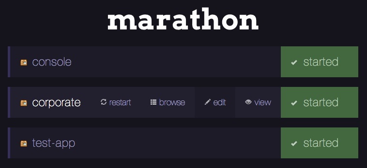

## it's like [pow](http://pow.cx), but for node

Marathon manages your Node.js application servers to get you up and running quickly. No more starting and stopping servers in your development environment. No more managing application port numbers. No more http://localhost:3000. Just a straightforward web interface, and clean, simple URLs.

## installation

    $ npm install marathon -g

During installation, you'll need to answer a couple quick questions about how you want your files setup. After that, it's free and clear. Marathon will automatically start in the background each time you start your computer.

## usage
By default, Marathon will inspect `~/.marathon` for projects to run (this can be changed during installation).

For each folder inside `~/.marathon`, Marathon will check to see if a `package.json` exists, and if it has a `scripts.start` property. If so, Marathon will run the start command.

## pretty urls
You can see live projects at a pretty URL. Just take the folder name, and add `.dev` (or whatever TLD you chose during installation). For example, for a project with a folder named `my-express-app`, you could reach that server at [my-express-app.dev](http://my-express-app.dev/).

## manage your apps
To manage your running applications, check out [marathon.dev](http://marathon.dev/). From there you can:

* restart the server
* open a Finder window of the source
* launch your favorite editor on the source
* open the server in a new tab

## logs
Output from each server is sent to a log file (by default, in `~/.marathon/logs`). If you want to see the output of your server in realtime, just run:

    $ tail -f ~/.marathon/logs/my-project-name.log

## why sudo?
The installation script will ask you for your password while it sets up the local DNS forwarding. If you are concerned about what is happening under the hood, feel free to check out the [install script source](https://github.com/davewasmer/marathon/blob/master/scripts/install.sh) - it isn't very long, and should be straightforward.

Essentially, to get the pretty URLs you see, Marathon does three things:

* Adds an entry to the `/etc/resolver` folder. This tells your Mac to resolve any requests for a `*.dev` domain (or whatever TLD you chose during installation) to a local DNS server run by Marathon.
* Adds an `ipfw` rule that tells your Mac to forward any inbound traffic on port 80 to your local machine to a different port (one which doesn't require elevated permissions to use) where the Marathon server will be listening.
* Adds a launch agent that will start the Marathon server on login. This step actually doesn't require elevated permissions.

## Contributions

Contributions are more than welcome! Fork it and pull it. You know the drill.

## License

Permission is hereby granted, free of charge, to any person obtaining a copy of this software and associated documentation files (the "Software"), to deal in the Software without restriction, including without limitation the rights to use, copy, modify, merge, publish, distribute, sublicense, and/or sell copies of the Software, and to permit persons to whom the Software is furnished to do so, subject to the following conditions:

The above copyright notice and this permission notice shall be included in all copies or substantial portions of the Software.

THE SOFTWARE IS PROVIDED "AS IS", WITHOUT WARRANTY OF ANY KIND, EXPRESS OR IMPLIED, INCLUDING BUT NOT LIMITED TO THE WARRANTIES OF MERCHANTABILITY, FITNESS FOR A PARTICULAR PURPOSE AND NONINFRINGEMENT. IN NO EVENT SHALL THE AUTHORS OR COPYRIGHT HOLDERS BE LIABLE FOR ANY CLAIM, DAMAGES OR OTHER LIABILITY, WHETHER IN AN ACTION OF CONTRACT, TORT OR OTHERWISE, ARISING FROM, OUT OF OR IN CONNECTION WITH THE SOFTWARE OR THE USE OR OTHER DEALINGS IN THE SOFTWARE.